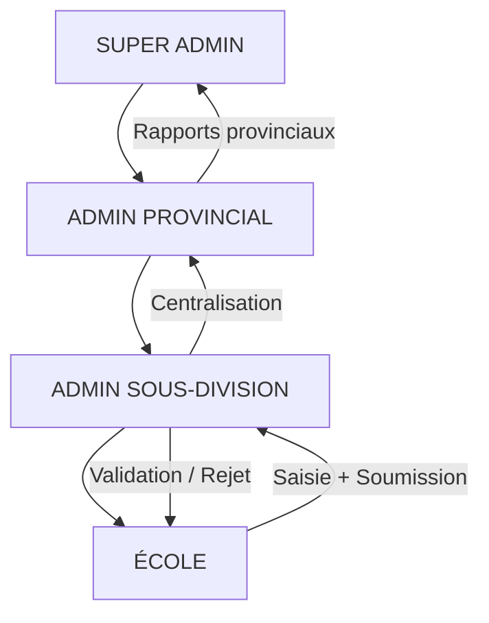
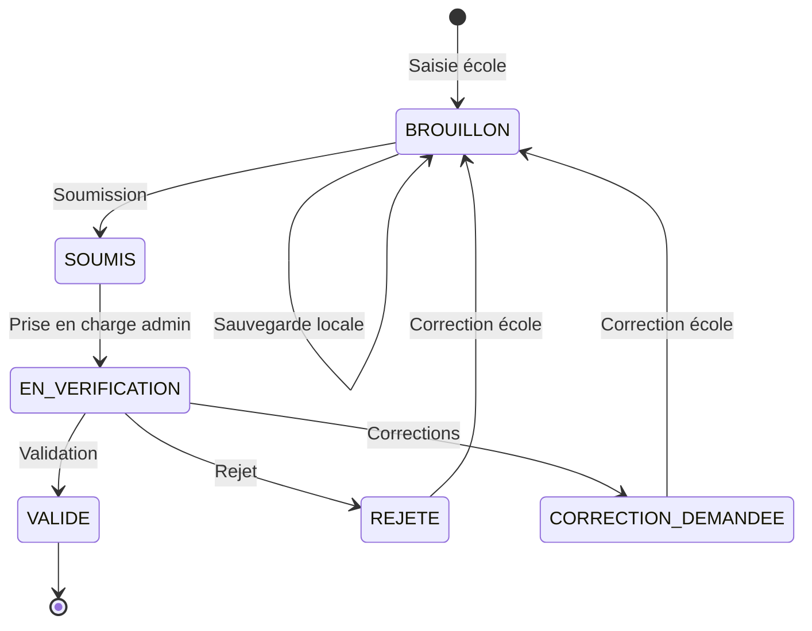
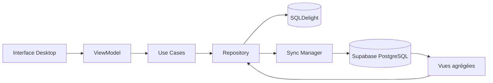

# Analyse des besoins — Système de collecte des statistiques scolaires

## 1. Contexte et problématique

Les établissements scolaires doivent déclarer annuellement leurs statistiques (effectifs élèves, enseignants, inscriptions début/fin d'année, résultats certificatifs). Ces données doivent être **centralisées automatiquement** au niveau de la **Sous-Division** pour permettre aux administrateurs de vérifier, valider, analyser et produire des rapports.

### Contraintes majeures

| Contrainte | Implication |
|------------|-------------|
| Desktop First (Windows prioritaire) | UI adaptée grands écrans, sidebar, tableaux riches |
| Supabase = source officielle | Toute donnée validée vit dans PostgreSQL |
| Offline First | SQLDelight local + file de sync |
| Multi-rôles hiérarchiques | RLS strict par province / sous-division / école |
| Phase 2 Android | Maximum de code dans `commonMain` |
| Développement progressif | Pas de big-bang, livraisons incrémentales |

---

## 2. Acteurs et responsabilités

### Matrice des capacités

| Capacité | Super Admin | Admin Provincial | Admin Sous-Division | École |
|----------|:-----------:|:----------------:|:-------------------:|:-----:|
| Gérer provinces / sous-divisions | ✅ | ❌ | ❌ | ❌ |
| Gérer écoles | ✅ | Lecture province | ✅ sa SD | Profil propre |
| Saisir statistiques | ❌ | ❌ | ❌ | ✅ |
| Soumettre déclaration | ❌ | ❌ | ❌ | ✅ |
| Vérifier / Valider / Rejeter | ✅ | Lecture | ✅ | ❌ |
| Centralisation & rapports | ✅ National | ✅ Provincial | ✅ SD | ❌ |
| Gérer utilisateurs | ✅ | Limité | Limité SD | ❌ |

---

## 3. Processus métier principal

### 3.1 Cycle de vie d'une déclaration

### 3.2 Flux de données

---

## 4. Domaines fonctionnels

### 4.1 Référentiels organisationnels
- Provinces, provinces éducationnelles, sous-divisions, écoles
- Années scolaires actives
- Configuration dynamique : classes primaires, sections/options secondaires, types d'épreuves

### 4.2 Collecte statistique (par école, par année)
1. **Primaire** — effectifs par classe et sexe
2. **Secondaire** — effectifs par section, option, classe et sexe
3. **Enseignants** — par niveau d'études, branche et sexe
4. **Début d'année** — inscriptions initiales par classe
5. **Fin d'année** — effectifs finaux + calculs (différence, rétention, abandon)
6. **Épreuves certificatives** — inscrits, participants, réussites, échecs

### 4.3 Workflow administratif
- Suivi des soumissions par école
- Validation avec commentaires obligatoires en cas de rejet
- Notifications temps réel (Supabase Realtime)
- Audit complet des actions sensibles

### 4.4 Centralisation et analyse
- Agrégation automatique via vues PostgreSQL
- Dashboard avec KPIs et graphiques filtrables
- Export Excel / PDF respectant les filtres actifs

---

## 5. Exigences non fonctionnelles

| Catégorie | Exigence |
|-----------|----------|
| **Sécurité** | RLS sur toutes les tables sensibles ; jamais de Service Role Key côté client |
| **Performance** | Pagination, lazy loading, index PostgreSQL, cache local |
| **Disponibilité** | Mode hors ligne complet pour la saisie école |
| **Traçabilité** | `audit_logs` sur CREATE, UPDATE, DELETE, SUBMIT, VALIDATE, REJECT |
| **UX** | Material 3, mode clair/sombre, états chargement/vide/erreur |
| **Maintenabilité** | Clean Architecture, SOLID, tests unitaires sur domaine et sync |

---

## 6. Périmètre Phase 1 (Desktop)

### Inclus
- Auth Supabase + gestion profils/rôles
- Gestion écoles (admin SD)
- Saisie statistiques complète (primaire, secondaire, enseignants, inscriptions, certificatives)
- Workflow soumission / validation
- Dashboard admin + centralisation
- Offline first avec sync
- Exports Excel et PDF basiques

### Exclu (Phase 2)
- Application Android complète
- Notifications push mobiles
- Edge Functions avancées (génération rapports lourds) — préparées mais optionnelles en Phase 1

---

## 7. Risques identifiés

| Risque | Mitigation |
|--------|------------|
| Conflits sync offline | Stratégie par statut (brouillon = client, validé = serveur) |
| Volume de données | Pagination + vues matérialisées si nécessaire |
| Complexité formulaires dynamiques | Tables de configuration + metadata JSON limitée |
| Division par zéro (taux) | Validation domaine + garde-fous UI |
| Fuites données inter-écoles | RLS + tests automatisés par rôle |

---

## 8. Critères de succès

1. Une école peut saisir, sauvegarder hors ligne et soumettre ses statistiques
2. Un admin SD voit uniquement les écoles de sa sous-division
3. La centralisation agrège automatiquement les données validées
4. Les exports reflètent les filtres sélectionnés
5. Le code métier est partageable à 80 %+ pour Android (Phase 2)
