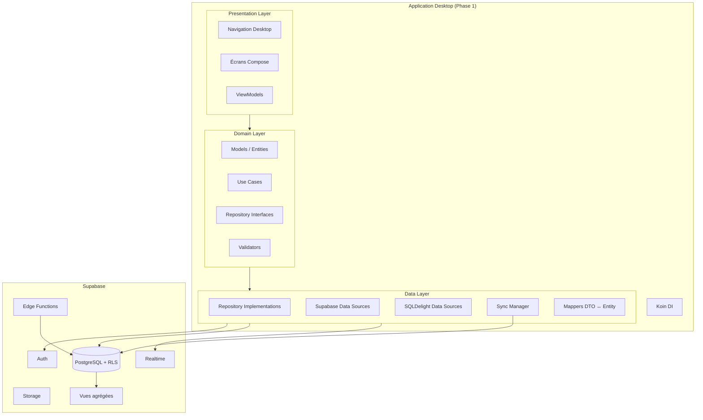
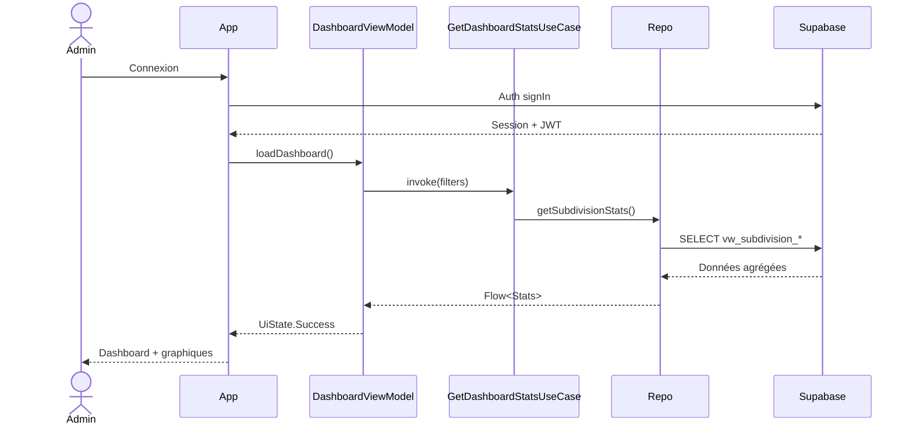
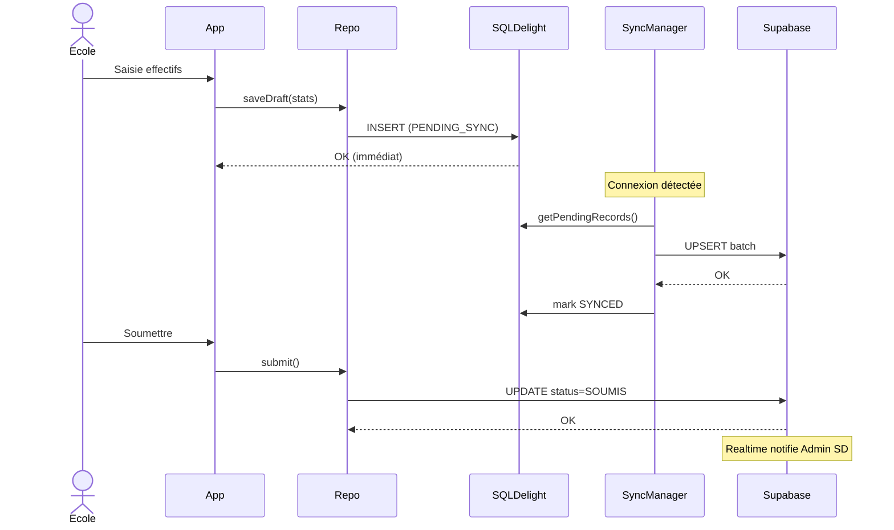
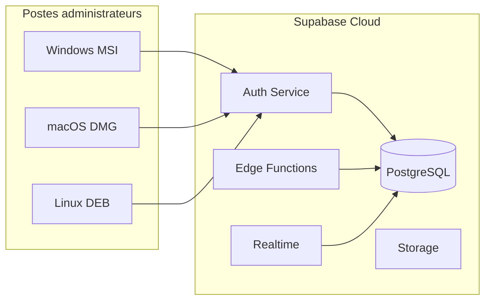

# Architecture technique — KCoreSystem (Statistiques Scolaires)

## 1. Vue d'ensemble



---

## 2. Principes architecturaux

### Clean Architecture + MVVM

| Couche | Responsabilité | Dépendances |
|--------|----------------|-------------|
| **Presentation** | UI Compose, navigation, ViewModels, UiState | Domain uniquement |
| **Domain** | Logique métier pure, use cases, modèles, interfaces | Aucune couche externe |
| **Data** | Implémentations repositories, sources remote/local, sync | Domain (interfaces) + Supabase/SQLDelight |

**Règle d'or** : les dépendances pointent toujours vers l'intérieur (vers le domaine).

### Patterns utilisés

- **Repository Pattern** — abstraction unique pour local + remote
- **Use Cases** — une action métier = un use case (ex: `SubmitDeclarationUseCase`)
- **Observer (Flow)** — réactivité UI via Kotlin Flow
- **Outbox Pattern** — file d'attente sync pour écritures offline
- **Single Source of Truth** — Supabase pour données officielles ; SQLDelight pour cache + offline

---

## 3. Modules Gradle proposés

Évolution progressive du projet existant :

```
KCoreSystem/
├── desktopApp/                    # UI Desktop uniquement
├── shared/                        # Code KMP partagé
│   └── src/
│       ├── commonMain/kotlin/com/schoolstats/
│       │   ├── domain/
│       │   │   ├── model/
│       │   │   ├── repository/
│       │   │   ├── usecase/
│       │   │   └── validation/
│       │   ├── data/
│       │   │   ├── remote/        # Supabase client, DTOs
│       │   │   ├── local/         # SQLDelight, DAOs
│       │   │   ├── repository/    # Implémentations
│       │   │   ├── sync/          # SyncManager, Outbox
│       │   │   └── mapper/
│       │   ├── presentation/
│       │   │   ├── viewmodel/     # ViewModels partagés
│       │   │   ├── state/         # UiState sealed classes
│       │   │   └── theme/         # Material 3 theme
│       │   ├── di/                # Modules Koin
│       │   └── util/
│       ├── commonTest/
│       ├── jvmMain/               # Drivers SQLDelight JVM, exports Desktop
│       └── androidMain/           # (Phase 2) Drivers Android
├── supabase/
│   ├── migrations/
│   ├── functions/
│   └── policies/
└── docs/
```

> **Note** : Le package `com.example.kcoresystem` sera renommé progressivement en `com.schoolstats` lors de l'implémentation.

---

## 4. Stack technique

| Composant | Technologie | Version cible |
|-----------|-------------|---------------|
| Langage | Kotlin | 2.4+ |
| UI | Compose Multiplatform + Material 3 | 1.11+ |
| Desktop | JVM + Compose Desktop | Windows / macOS / Linux |
| Backend | Supabase (PostgreSQL, Auth, Realtime, Storage) | Latest |
| Client Supabase | supabase-kt | 3.x |
| Base locale | SQLDelight | 2.x |
| DI | Koin | 4.x |
| Async | Coroutines + Flow | 1.11+ |
| Sérialisation | kotlinx.serialization | — |
| Export Excel | Apache POI (jvmMain) | — |
| Export PDF | iText ou OpenPDF (jvmMain) | — |
| Graphiques | Vico ou Compose Charts | — |
| Tests | kotlin.test + Turbine (Flow) | — |

---

## 5. Flux utilisateur Desktop

### 5.1 Admin Sous-Division (utilisateur principal Phase 1)



### 5.2 École (saisie offline)



---

## 6. Gestion des rôles et permissions

### Modèle hybride

1. **`profiles.role`** — rôle principal (enum PostgreSQL)
2. **`roles` + `permissions` + `user_roles`** — permissions granulaires futures

### Rôle stocké dans JWT via claim custom (optionnel)

```sql
-- Trigger post-auth pour enrichir le JWT
-- auth.jwt() ->> 'user_role'
```

### Contrôle côté client

- Navigation filtrée par rôle (menu sidebar dynamique)
- Use cases vérifient le rôle avant action sensible
- **La sécurité réelle est toujours côté RLS Supabase**

---

## 7. Couche Presentation Desktop

### Layout principal

```
┌─────────────────────────────────────────────────────────┐
│ Header (titre, user, sync status, notifications)        │
├──────────┬──────────────────────────────────────────────┤
│          │                                              │
│ Sidebar  │  Contenu principal                           │
│ (menu    │  (Dashboard, tableaux, formulaires)        │
│  filtré  │                                              │
│  rôle)   │                                              │
│          │                                              │
└──────────┴──────────────────────────────────────────────┘
```

### Navigation

Utiliser une sealed class `Screen` / `Route` :

```kotlin
sealed class AppRoute(val label: String, val requiredRoles: Set<UserRole>) {
    data object Dashboard : AppRoute("Dashboard", setOf(...))
    data object Schools : AppRoute("Écoles", setOf(...))
    // ...
}
```

---

## 8. Configuration et secrets

### Variables d'environnement (jamais commitées)

```properties
SUPABASE_URL=https://xxx.supabase.co
SUPABASE_ANON_KEY=eyJ...
```

Chargement :
- **Desktop** : fichier `local.properties` ou variables système
- **Build** : `BuildConfig` généré au build (Gradle)

### Fichiers à ignorer (.gitignore)

```
local.properties
.env
supabase/.env
```

---

## 9. Stratégie de tests

| Niveau | Cible | Exemples |
|--------|-------|----------|
| Unit | Domain | Validators, calculs taux, use cases |
| Unit | Data | Mappers, sync conflict resolver |
| Integration | SQLDelight | DAO queries in-memory |
| Integration | Supabase | Tests RLS avec utilisateurs test (CI) |
| UI | Desktop | Navigation, formulaires critiques |

---

## 10. Diagramme de déploiement



---

## 11. Décisions architecturales (ADR)

| # | Décision | Justification |
|---|----------|---------------|
| ADR-001 | Supabase comme backend unique | Auth + DB + Realtime intégrés, RLS natif |
| ADR-002 | SQLDelight vs Room | SQLDelight = KMP natif, requêtes typées |
| ADR-003 | Koin vs KMP DI | Simplicité, bon support KMP |
| ADR-004 | ViewModels dans commonMain | Réutilisables Android Phase 2 |
| ADR-005 | UI Desktop dans desktopApp | Séparation claire Desktop First |
| ADR-006 | Vues PostgreSQL pour centralisation | Agrégation côté serveur, performant |
| ADR-007 | Outbox sync vs CRDT | Outbox plus simple pour ce cas d'usage |
| ADR-008 | Pas de Service Role Key client | Sécurité — Edge Functions pour ops sensibles |
