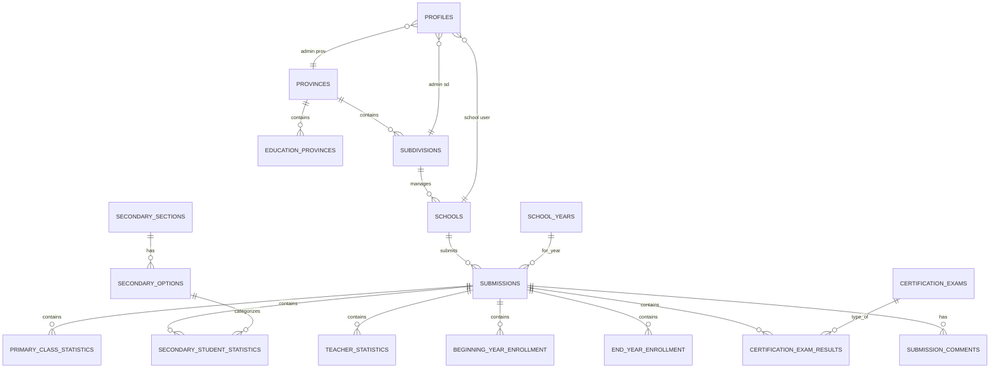

# Modèle de données — Entités et relations

## 1. Diagramme entité-relation (simplifié)



---

## 2. Énumérations domaine (Kotlin)

```kotlin
enum class UserRole {
    SUPER_ADMIN,
    ADMIN_PROVINCIAL,
    ADMIN_SOUS_DIVISION,
    ECOLE
}

enum class SubmissionStatus {
    BROUILLON,
    SOUMIS,
    EN_VERIFICATION,
    VALIDE,
    REJETE,
    CORRECTION_DEMANDEE
}

enum class SyncStatus {
    SYNCED,
    PENDING_SYNC,
    SYNCING,
    SYNC_FAILED,
    CONFLICT
}

enum class SchoolType {
    PRIMAIRE,
    SECONDAIRE,
    PRIMAIRE_ET_SECONDAIRE
}

enum class SchoolOwnership {
    PUBLIQUE,
    PRIVEE
}

enum class SchoolConvention {
    CONVENTIONNEE,
    NON_CONVENTIONNEE
}

enum class SchoolEnvironment {
    URBAIN,
    RURAL
}

enum class EducationLevel {
    D4, D6, GRADUE, LICENCE, MASTER, DOCTORAT, AUTRES
}

enum class TeacherBranch {
    PRIMAIRE,
    SECONDAIRE_GENERAL,
    SECONDAIRE_TECHNIQUE,
    SECONDAIRE_PROFESSIONNEL,
    AUTRES
}

enum class Gender {
    MALE, FEMALE
}

enum class AuditAction {
    CREATE, UPDATE, DELETE, SUBMIT, VALIDATE, REJECT
}
```

---

## 3. Entités organisationnelles

### Province
| Champ | Type | Description |
|-------|------|-------------|
| id | UUID | PK |
| name | String | Nom province |
| code | String | Code unique |
| is_active | Boolean | Actif |
| created_at / updated_at | Timestamp | Audit |

### EducationProvince (Province Éducationnelle)
| Champ | Type | Description |
|-------|------|-------------|
| id | UUID | PK |
| province_id | UUID | FK → provinces |
| name | String | Nom |
| code | String | Code |

### Subdivision (Sous-Division)
| Champ | Type | Description |
|-------|------|-------------|
| id | UUID | PK |
| province_id | UUID | FK → provinces |
| education_province_id | UUID? | FK optionnel |
| name | String | Nom |
| code | String | Code unique |

### School (École)
| Champ | Type | Description |
|-------|------|-------------|
| id | UUID | PK |
| subdivision_id | UUID | FK → subdivisions |
| name | String | Nom établissement |
| school_code | String | Code école |
| dinacope_id | String? | ID DINACOPE |
| address | String? | Adresse |
| city | String? | Ville |
| commune_territory | String? | Commune/Territoire |
| sector_quarter | String? | Secteur/Quartier |
| latitude / longitude | Double? | Géolocalisation |
| principal_name | String? | Chef d'établissement |
| principal_phone | String? | Téléphone |
| management_regime | String? | Régime de gestion |
| school_type | SchoolType | Type école |
| ownership | SchoolOwnership | Public/Privé |
| convention | SchoolConvention? | Conventionnée |
| environment | SchoolEnvironment? | Urbain/Rural |
| is_active | Boolean | Actif |
| deleted_at | Timestamp? | Soft delete |

### SchoolYear
| Champ | Type | Description |
|-------|------|-------------|
| id | UUID | PK |
| name | String | Ex: "2025-2026" |
| start_date | Date | Début |
| end_date | Date | Fin |
| is_active | Boolean | Année courante |

---

## 4. Utilisateurs

### Profile (lié à auth.users)
| Champ | Type | Description |
|-------|------|-------------|
| id | UUID | PK = auth.users.id |
| full_name | String | Nom complet |
| email | String | Email |
| phone | String? | Téléphone |
| role | UserRole | Rôle principal |
| school_id | UUID? | Si rôle ECOLE |
| subdivision_id | UUID? | Si admin SD |
| province_id | UUID? | Si admin provincial |
| is_active | Boolean | Compte actif |

**Contrainte** : selon le rôle, un seul des FK organisationnels est renseigné.

---

## 5. Soumission (entité centrale workflow)

### Submission
| Champ | Type | Description |
|-------|------|-------------|
| id | UUID | PK |
| school_id | UUID | FK |
| school_year_id | UUID | FK |
| status | SubmissionStatus | Statut workflow |
| submitted_at | Timestamp? | Date soumission |
| validated_at | Timestamp? | Date validation |
| validated_by | UUID? | FK → profiles |
| rejected_at | Timestamp? | Date rejet |
| rejected_by | UUID? | FK → profiles |
| rejection_reason | String? | Motif rejet |
| sync_status | SyncStatus | Statut sync local |

> Une soumission regroupe toutes les statistiques d'une école pour une année scolaire.

---

## 6. Statistiques élèves — Primaire

### PrimaryClassStatistics
| Champ | Type | Description |
|-------|------|-------------|
| id | UUID | PK |
| submission_id | UUID | FK |
| school_id | UUID | FK (dénormalisé pour RLS) |
| school_year_id | UUID | FK |
| class_name | String | Ex: "1ère année" |
| class_order | Int | Ordre affichage |
| boys_count | Int | Garçons ≥ 0 |
| girls_count | Int | Filles ≥ 0 |
| total_count | Int | **Calculé** = boys + girls |

### PrimaryClassConfig (configuration admin)
| Champ | Type | Description |
|-------|------|-------------|
| id | UUID | PK |
| name | String | Nom classe |
| order_index | Int | Ordre |
| is_active | Boolean | Active |
| school_type_filter | SchoolType? | Filtre optionnel |

---

## 7. Statistiques élèves — Secondaire

### SecondarySection
| Champ | Type | Description |
|-------|------|-------------|
| id | UUID | PK |
| name | String | Ex: "Enseignement Général" |
| code | String | Code |
| order_index | Int | Ordre |
| is_active | Boolean | Active |

### SecondaryOption
| Champ | Type | Description |
|-------|------|-------------|
| id | UUID | PK |
| section_id | UUID | FK |
| name | String | Ex: "Latin-Philosophie" |
| code | String | Code |
| order_index | Int | Ordre |

### SecondaryStudentStatistics
| Champ | Type | Description |
|-------|------|-------------|
| id | UUID | PK |
| submission_id | UUID | FK |
| school_id | UUID | FK |
| section_id | UUID | FK |
| option_id | UUID? | FK (nullable si N/A) |
| class_name | String | Classe |
| boys_count | Int | Garçons |
| girls_count | Int | Filles |
| total_count | Int | Calculé |

---

## 8. Enseignants

### TeacherStatistics (en-tête par soumission)
| Champ | Type | Description |
|-------|------|-------------|
| id | UUID | PK |
| submission_id | UUID | FK |
| school_id | UUID | FK |

### TeacherStatisticsDetail (lignes)
| Champ | Type | Description |
|-------|------|-------------|
| id | UUID | PK |
| teacher_statistics_id | UUID | FK |
| education_level | EducationLevel | Niveau |
| branch | TeacherBranch | Branche |
| men_count | Int | Hommes |
| women_count | Int | Femmes |
| total_count | Int | Calculé |

---

## 9. Inscriptions début / fin d'année

### BeginningYearEnrollment / EndYearEnrollment
| Champ | Type | Description |
|-------|------|-------------|
| id | UUID | PK |
| submission_id | UUID | FK |
| school_id | UUID | FK |
| class_name | String | Classe |
| boys_count | Int | Garçons |
| girls_count | Int | Filles |
| total_count | Int | Calculé |

### Calculs dérivés (domaine, pas stockés)
```kotlin
data class EnrollmentComparison(
    val beginningTotal: Int,
    val endTotal: Int,
    val difference: Int,          // beginning - end
    val retentionRate: Double?,     // (end / beginning) * 100, null si beginning = 0
    val dropoutRate: Double?        // 100 - retentionRate
)
```

---

## 10. Épreuves certificatives

### CertificationExam (configuration)
| Champ | Type | Description |
|-------|------|-------------|
| id | UUID | PK |
| name | String | Ex: TENAFEP |
| code | String | Code |
| is_active | Boolean | Active |

### CertificationExamResult
| Champ | Type | Description |
|-------|------|-------------|
| id | UUID | PK |
| submission_id | UUID | FK |
| school_id | UUID | FK |
| exam_id | UUID | FK |
| class_name | String | Classe |
| registered_count | Int | Inscrits |
| participants_count | Int | Participants ≤ inscrits |
| successes_count | Int | Réussites |
| failures_count | Int | Échecs = participants - réussites |
| boys_succeeded | Int | Garçons réussis |
| girls_succeeded | Int | Filles réussies |
| success_rate | Double | **Calculé** = successes / participants * 100 |

---

## 11. Notifications et audit

### Notification
| Champ | Type | Description |
|-------|------|-------------|
| id | UUID | PK |
| user_id | UUID | Destinataire |
| type | String | SUBMITTED, VALIDATED, REJECTED, etc. |
| title | String | Titre |
| message | String | Contenu |
| reference_id | UUID? | ID entité liée |
| is_read | Boolean | Lu |
| created_at | Timestamp | Date |

### AuditLog
| Champ | Type | Description |
|-------|------|-------------|
| id | UUID | PK |
| user_id | UUID | Acteur |
| action | AuditAction | Action |
| table_name | String | Table |
| record_id | UUID | Enregistrement |
| old_value | JSONB? | Ancienne valeur |
| new_value | JSONB? | Nouvelle valeur |
| ip_address | String? | IP (Edge Function) |
| created_at | Timestamp | Date |

---

## 12. Métadonnées sync (SQLDelight local)

Chaque table locale importante inclut :

| Champ | Type | Description |
|-------|------|-------------|
| local_id | String | ID local (UUID) |
| remote_id | String? | ID Supabase après sync |
| sync_status | SyncStatus | Statut |
| last_synced_at | Long? | Timestamp sync |
| version | Int | Version pour détection conflit |
| is_deleted | Boolean | Soft delete local |

### SyncOutbox (file d'attente)
| Champ | Type | Description |
|-------|------|-------------|
| id | Long | PK auto |
| entity_type | String | Type entité |
| entity_id | String | ID local |
| operation | String | INSERT, UPDATE, DELETE |
| payload | String | JSON sérialisé |
| created_at | Long | Timestamp |
| retry_count | Int | Tentatives |
| last_error | String? | Dernière erreur |

---

## 13. Règles de validation métier

| # | Règle | Niveau |
|---|-------|--------|
| V1 | `boys + girls == total` | Domain + DB trigger |
| V2 | Comptages ≥ 0 | Domain + DB CHECK |
| V3 | `participants ≤ registered` | Domain |
| V4 | `successes + failures == participants` | Domain |
| V5 | Champs obligatoires avant soumission | Use case |
| V6 | Pas de validation si erreurs critiques | Use case admin |
| V7 | `end ≤ beginning * 1.1` (warning, pas blocage) | Domain warning |
| V8 | Division par zéro → taux = null | Domain |

---

## 14. Cardinalités clés

| Relation | Cardinalité |
|----------|-------------|
| Province → Subdivisions | 1:N |
| Subdivision → Schools | 1:N |
| School → Submissions (par année) | 1:1 |
| Submission → PrimaryClassStatistics | 1:N |
| Submission → TeacherStatisticsDetail | 1:N |
| SecondarySection → SecondaryOptions | 1:N |
| User (ECOLE) → School | N:1 |
| User (ADMIN_SD) → Subdivision | N:1 |
