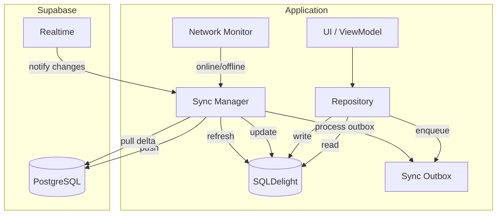
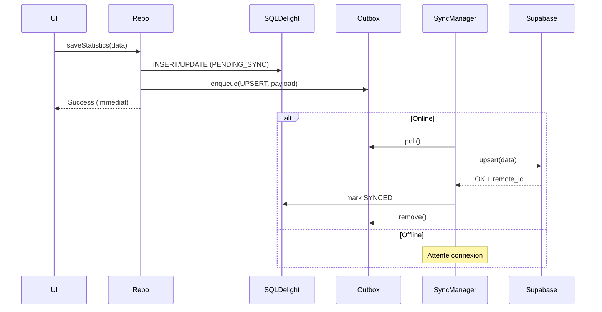
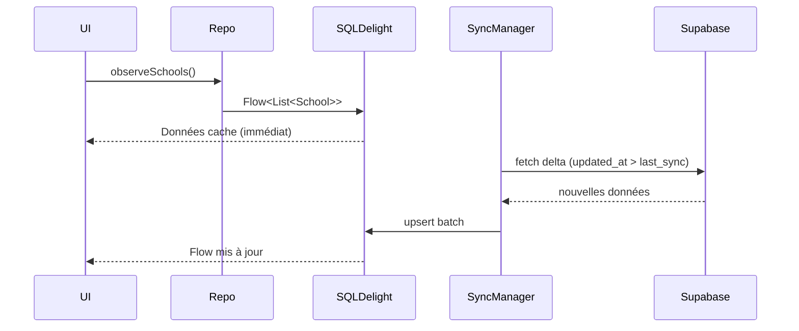

# Stratégie Offline First et Synchronisation

## 1. Principe fondamental

```
┌─────────────────────────────────────────────────────────┐
│  SUPABASE PostgreSQL = Source unique de vérité OFFICIELLE │
│  SQLDelight = Cache local + Mode hors ligne + File sync  │
└─────────────────────────────────────────────────────────┘
```

L'application **lit toujours depuis le cache local** (SQLDelight) pour la réactivité, et **écrit localement d'abord** en mode offline. Le Sync Manager pousse vers Supabase dès que le réseau est disponible.

---

## 2. Architecture sync



---

## 3. Statuts de synchronisation

| Statut | Signification | Action UI |
|--------|---------------|-----------|
| `SYNCED` | Donnée alignée avec Supabase | Aucune |
| `PENDING_SYNC` | Modification locale en attente | Icône "en attente" |
| `SYNCING` | Sync en cours | Spinner |
| `SYNC_FAILED` | Échec après retries | Bouton "Réessayer" |
| `CONFLICT` | Conflit détecté | Dialog résolution |

---

## 4. Flux d'écriture (Write-Through Local First)



---

## 5. Flux de lecture (Read from Local, Refresh from Remote)



---

## 6. Outbox Pattern

### Structure de la file

```sql
-- SQLDelight: SyncOutbox.sq
CREATE TABLE sync_outbox (
    id INTEGER PRIMARY KEY AUTOINCREMENT,
    entity_type TEXT NOT NULL,
    entity_id TEXT NOT NULL,
    operation TEXT NOT NULL,  -- INSERT, UPDATE, DELETE
    payload TEXT NOT NULL,    -- JSON
    created_at INTEGER NOT NULL,
    retry_count INTEGER DEFAULT 0,
    last_error TEXT,
    priority INTEGER DEFAULT 0
);
```

### Ordre de traitement

1. **Priorité haute** : soumissions (`submissions`)
2. **Priorité normale** : statistiques liées
3. **Priorité basse** : métadonnées, notifications

### Retry policy

| Tentative | Délai | Action |
|-----------|-------|--------|
| 1-3 | Immédiat | Retry automatique |
| 4-6 | 30s, 1min, 5min | Backoff exponentiel |
| 7+ | — | `SYNC_FAILED`, notification utilisateur |

---

## 7. Résolution de conflits

### Matrice de décision

| Statut serveur | Statut local | Résolution |
|----------------|--------------|------------|
| BROUILLON | BROUILLON | **Last-write-wins** (timestamp) |
| BROUILLON | PENDING_SYNC | Client gagne |
| SOUMIS+ | BROUILLON | Serveur gagne (école ne peut pas écraser) |
| SOUMIS+ | PENDING_SYNC | **CONFLICT** → résolution manuelle |
| VALIDE | * | **Serveur gagne toujours** |
| REJETE | PENDING_SYNC | Client peut resoumettre |

### Algorithme ConflictResolver

```kotlin
class ConflictResolver {
    fun resolve(
        local: SyncableEntity,
        remote: SyncableEntity
    ): ConflictResolution {
        return when {
            remote.submissionStatus == SubmissionStatus.VALIDE ->
                ConflictResolution.UseRemote
            local.updatedAt > remote.updatedAt &&
                remote.submissionStatus == SubmissionStatus.BROUILLON ->
                ConflictResolution.UseLocal
            local.updatedAt == remote.updatedAt ->
                ConflictResolution.NoConflict
            else ->
                ConflictResolution.Manual(local, remote)
        }
    }
}
```

---

## 8. Sync Manager — Composants

```kotlin
interface SyncManager {
    val syncState: StateFlow<SyncState>
    fun start()
    fun stop()
    suspend fun syncNow(): SyncResult
    suspend fun retryFailed(): SyncResult
}

data class SyncState(
    val isOnline: Boolean,
    val isSyncing: Boolean,
    val pendingCount: Int,
    val failedCount: Int,
    val lastSyncAt: Instant?,
    val lastError: String?
)
```

### Déclencheurs de sync

| Événement | Action |
|-----------|--------|
| App démarrage | Pull référentiels + données utilisateur |
| Connexion rétablie | Process outbox complet |
| Soumission utilisateur | Push immédiat si online |
| Realtime event | Pull delta ciblé |
| Timer (5 min) | Pull delta si online |
| Bouton "Synchroniser" | Sync manuel complet |

---

## 9. Tables synchronisées

### Pull (serveur → local) — Lecture

| Table | Fréquence | Filtre |
|-------|-----------|--------|
| provinces, subdivisions, schools | Au login + delta | scope utilisateur (RLS) |
| school_years | Au login | is_active |
| secondary_sections, options | Au login | is_active |
| certification_exams | Au login | is_active |
| submissions + stats | Delta | school_id / subdivision_id |
| notifications | Realtime | user_id |

### Push (local → serveur) — Écriture

| Table | Qui écrit | Condition |
|-------|-----------|-----------|
| primary_class_statistics | École | status = BROUILLON |
| secondary_student_statistics | École | status = BROUILLON |
| teacher_statistics_* | École | status = BROUILLON |
| beginning/end_year_enrollment | École | status = BROUILLON |
| certification_exam_results | École | status = BROUILLON |
| submissions (submit) | École | transition BROUILLON → SOUMIS |
| submissions (validate/reject) | Admin SD | via Edge Function |

> **Important** : Validation et rejet passent par Edge Functions (jamais directement depuis le client).

---

## 10. Realtime Supabase

### Channels souscrits

```kotlin
// Admin SD : nouvelles soumissions de sa sous-division
channel("submissions:subdivision:${subdivisionId}")

// École : statut de sa déclaration
channel("submissions:school:${schoolId}")

// Notifications utilisateur
channel("notifications:user:${userId}")
```

### Événements écoutés

| Event | Action locale |
|-------|---------------|
| INSERT submission (SOUMIS) | Notification admin + refresh liste |
| UPDATE submission (VALIDE/REJETE) | Notification école + refresh statut |
| INSERT notification | Afficher badge + toast |

---

## 11. Gestion réseau

```kotlin
// jvmMain — NetworkMonitor
expect class NetworkMonitor {
    val isOnline: StateFlow<Boolean>
    fun startMonitoring()
    fun stopMonitoring()
}

// Desktop : vérification connectivité via ping Supabase health endpoint
// Android (Phase 2) : ConnectivityManager
```

---

## 12. Indicateurs UI sync

### Header global

```
[🟢 Synchronisé]  ou  [🟡 3 en attente]  ou  [🔴 Échec sync]  [↻ Synchroniser]
```

### Par enregistrement (tableau écoles)

| Colonne | Exemple |
|---------|---------|
| Dernière sync | "Il y a 2 min" |
| Statut | Badge SYNCED / PENDING / FAILED |

---

## 13. Scénarios de test sync

| # | Scénario | Résultat attendu |
|---|----------|------------------|
| S1 | Saisie offline → reconnexion | Données pushées, statut SYNCED |
| S2 | Soumission offline → reconnexion | Status SOUMIS sur serveur |
| S3 | Modification concurrente brouillon | Last-write-wins |
| S4 | Admin valide pendant sync école | Serveur gagne, école notifiée |
| S5 | Échec réseau mid-sync | Retry auto, pas de perte |
| S6 | Rejet admin → école corrige offline | Correction pushée au retour online |

---

## 14. Limites et considérations

| Aspect | Décision |
|--------|----------|
| Taille cache local | Pas de limite Phase 1 ; scope RLS limite naturellement |
| Sync bidirectionnel | Oui pour référentiels ; écriture principalement local→remote |
| Chiffrement local | Non requis Phase 1 (données non ultra-sensibles) |
| Purge cache | Manuel via paramètres ; auto si logout |
| Idempotence | Toutes les opérations outbox utilisent UPSERT par ID |
