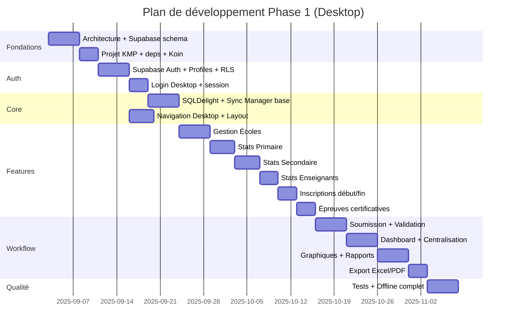

# Plan de développement — Étapes progressives

## Vue d'ensemble des phases

---

## Étape 0 — Architecture (EN COURS ✅)

**Livrables** :
- [x] Analyse des besoins
- [x] Architecture technique
- [x] Structure projet
- [x] Modèle de données
- [x] Schéma Supabase SQL
- [x] Politiques RLS
- [x] Stratégie offline/sync
- [x] Ce plan de développement

**Validation requise** avant de passer à l'étape 1.

---

## Étape 1 — Fondation projet KMP

**Objectif** : Projet compilable avec toutes les dépendances.

### Tâches
1. Renommer package `com.example.kcoresystem` → `com.schoolstats`
2. Ajouter dépendances : Supabase-kt, SQLDelight, Koin, kotlinx.serialization
3. Configurer SQLDelight (driver JVM)
4. Créer modules Koin vides
5. Créer `local.properties.example`
6. Configurer variables Supabase dans Gradle
7. Nettoyer code prototype existant (App Mosala)

### Critères d'acceptation
- `./gradlew :desktopApp:run` démarre sans erreur
- `./gradlew :shared:jvmTest` passe
- Structure packages conforme à `docs/03-structure-projet.md`

---

## Étape 2 — Schéma Supabase

**Objectif** : Base de données déployée avec RLS.

### Tâches
1. Appliquer migrations `supabase/migrations/`
2. Créer utilisateurs test (super admin, admin SD, école)
3. Seed données référentielles (provinces, classes, sections)
4. Tester RLS manuellement via Supabase Dashboard
5. Configurer Realtime sur tables `submissions`, `notifications`

### Critères d'acceptation
- Toutes les tables créées avec FK et index
- RLS actif sur toutes les tables sensibles
- 4 profils test avec accès correctement restreints

---

## Étape 3 — Authentification

**Objectif** : Login/logout fonctionnel Desktop.

### Tâches
1. `SupabaseClientProvider` (commonMain)
2. `AuthRepository` + `LoginUseCase` + `LogoutUseCase`
3. `AuthViewModel` + `LoginScreen` Desktop
4. Gestion session persistante (token refresh)
5. Chargement profil utilisateur post-login
6. Redirection selon rôle

### Critères d'acceptation
- Connexion avec email/password
- Session persistante au redémarrage
- Déconnexion propre
- Rôle affiché dans le header

---

## Étape 4 — Layout Desktop + Navigation

**Objectif** : Shell applicatif professionnel.

### Tâches
1. `MainLayout` (Sidebar + Header + Content)
2. `AppRoute` sealed class avec permissions par rôle
3. `Sidebar` dynamique filtrée par rôle
4. Theme Material 3 (clair/sombre)
5. États communs : Loading, Empty, Error
6. Indicateur sync dans le header

### Critères d'acceptation
- Navigation entre toutes les routes (écrans placeholder)
- Sidebar collapsible
- Menu adapté au rôle connecté

---

## Étape 5 — SQLDelight + Sync Manager (base)

**Objectif** : Infrastructure offline opérationnelle.

### Tâches
1. Schémas SQLDelight (organisation, stats, outbox)
2. `DatabaseDriverFactory` (jvmMain)
3. `NetworkMonitor` Desktop
4. `SyncManager` : outbox processing, retry
5. `ConflictResolver` basique
6. Intégration dans repositories

### Critères d'acceptation
- Écriture locale fonctionne offline
- Sync automatique au retour online
- Statut sync visible dans l'UI

---

## Étape 6 — Gestion des Écoles

**Objectif** : CRUD écoles pour admin SD.

### Tâches
1. Models + DTOs + Mappers `School`
2. `SchoolRepository` (local + remote)
3. Use cases : List, Get, Create, Update, Deactivate
4. `SchoolListScreen` avec DataTable (pagination, recherche, tri, filtres)
5. `SchoolFormDialog` (création/édition)
6. `SchoolDetailScreen`

### Critères d'acceptation
- Admin SD voit uniquement ses écoles
- CRUD complet avec validation
- Tableau professionnel avec toutes les fonctionnalités

---

## Étape 7 — Statistiques Primaire

**Objectif** : Saisie effectifs primaire par classe/sexe.

### Tâches
1. Models `PrimaryClassStat`, config classes
2. Repository + use cases save/load
3. Formulaire tableau dynamique (classes configurables)
4. Calculs automatiques totaux
5. Validation V1-V2
6. Sauvegarde brouillon offline

### Critères d'acceptation
- Tableau Classe | Garçons | Filles | Total
- Totaux globaux calculés en temps réel
- Erreurs de validation affichées clairement

---

## Étape 8 — Statistiques Secondaire

**Objectif** : Effectifs par section/option/classe.

### Tâches
1. Models sections/options
2. Admin config sections/options (paramètres)
3. Formulaire Section | Option | Classe | Garçons | Filles | Total
4. Validation + calculs

---

## Étape 9 — Enseignants + Inscriptions + Certificatives

**Objectif** : Modules statistiques restants.

### Sous-étapes parallélisables :
- 9a. Effectifs enseignants (niveau × branche × sexe)
- 9b. Inscriptions début/fin année + calculs rétention/abandon
- 9c. Résultats épreuves certificatives + taux réussite

---

## Étape 10 — Workflow Soumission / Validation

**Objectif** : Cycle complet brouillon → soumis → validé/rejeté.

### Tâches
1. `SubmissionRepository` + machine à états
2. `SubmitDeclarationUseCase`
3. Edge Functions : `validate-submission`, `reject-submission`
4. `SubmissionListScreen` (admin)
5. `ValidationScreen` avec commentaires obligatoires
6. Notifications Realtime

### Critères d'acceptation
- École soumet → admin notifié
- Admin valide/rejette avec commentaire
- École voit statut mis à jour
- Rejet → école peut corriger et resoumettre

---

## Étape 11 — Dashboard Admin

**Objectif** : Tableau de bord avec KPIs.

### Tâches
1. Vues PostgreSQL agrégées
2. `DashboardViewModel` + use cases stats
3. Cartes KPI (écoles, soumis, validés, en attente, etc.)
4. Graphiques filtrables (soumis/non soumis, G/F, par classe)

---

## Étape 12 — Centralisation

**Objectif** : Page agrégation principale.

### Tâches
1. Vues : `vw_subdivision_student_statistics`, etc.
2. `CentralizationScreen` avec filtres complets
3. Tableaux A-G (effectifs, classes, sections, options, enseignants, inscriptions, certificatives)
4. `CentralizationRepository`

---

## Étape 13 — Rapports et Exports

**Objectif** : Génération rapports Excel/PDF.

### Tâches
1. `ReportsScreen` avec sélection type rapport
2. `ExcelExporter` (Apache POI, jvmMain)
3. `PdfExporter` (OpenPDF, jvmMain)
4. Respect des filtres actifs
5. Edge Function `generate-report` (optionnel, rapports lourds)

---

## Étape 14 — Utilisateurs et Paramètres

**Objectif** : Gestion utilisateurs et configuration.

### Tâches
1. `UserManagementScreen` (admin)
2. Création comptes via Supabase Auth Admin API (Edge Function)
3. `SettingsScreen` (thème, sync manuel, config classes/sections)

---

## Étape 15 — Tests et stabilisation

**Objectif** : Qualité et robustesse.

### Tâches
1. Tests unitaires domaine (validators, calculs, use cases)
2. Tests sync (scénarios S1-S6)
3. Tests RLS automatisés
4. Tests UI navigation critique
5. Build distributions (MSI, DMG, DEB)
6. Documentation utilisateur

---

## Priorités absolues (rappel)

1. ✅ Architecture validée
2. Application Desktop Windows
3. Supabase source centrale
4. Gestion écoles
5. Collecte statistiques
6. Centralisation sous-division
7. Validation administrative
8. Rapports et analyses
9. Android — Phase 2 ultérieure

---

## Prochaine action

**Après validation de cette architecture**, démarrer l'**Étape 1** : configuration du projet KMP avec dépendances et structure de packages.

> Confirmez-vous cette architecture pour que je commence l'implémentation de l'Étape 1 ?
